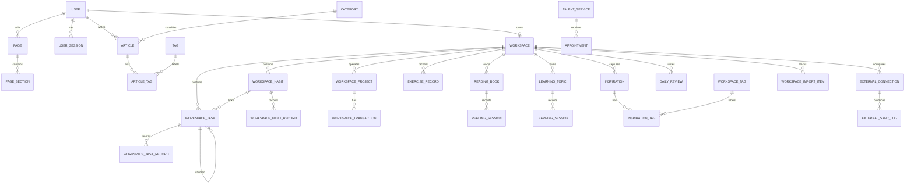

# 萧遥AI副业基地数据库设计

> 版本：2026-06-29

## 1. 选型结论

推荐继续使用 **Prisma + MySQL 协议数据库**。

- 本地开发：MySQL 8.x 或 MariaDB。
- 线上首选：TiDB Cloud Starter，兼容 MySQL，支持 Prisma，适合当前个人网站和成长工作台的数据量。
- 备选：如果后续希望直接使用数据库自带的认证、对象存储和实时订阅，可迁移到 Supabase PostgreSQL，但需要把 Prisma provider 从 `mysql` 改成 `postgresql` 并重新生成迁移。
- 暂不建议：SQLite/Turso 更适合单机或极轻量数据；当前项目已经有多模块关系、账本、内容管理和未来多设备同步，继续使用 MySQL 方言更稳妥。

TiDB Cloud Starter 当前免费额度可参考官方文档：

- https://docs.pingcap.com/tidbcloud/select-cluster-tier/
- https://docs.pingcap.com/tidb/dev/dev-guide-sample-application-nodejs-prisma/

## 2. 设计目标

1. 网站公开内容和个人工作台私有数据使用同一数据库，但表和关系边界清晰。
2. 所有私有数据必须通过 `workspaceId` 或其父级关系归属于具体用户。
3. 保存原始记录，完成率、连续天数、净收益等统计值动态计算，避免冗余字段失真。
4. 支持未来登录、多设备同步、数据导出和后台管理。
5. 金额使用 `DECIMAL`，日历日期使用 `DATE`，系统时间使用毫秒精度 `DATETIME(3)`。

## 3. 模块划分

### 3.1 用户与认证

| 表 | 作用 | 关键字段 |
|---|---|---|
| `users` | 管理员和未来工作台用户 | `username`、`passwordHash`、`email`、`role`、`isActive` |
| `user_sessions` | 登录会话 | `tokenHash`、`userId`、`expiresAt`、`lastSeenAt` |
| `workspaces` | 用户私有数据边界 | `ownerId`、`timezone`、`currency`、`settings` |

当前设计为一个用户对应一个 Workspace，`workspaces.ownerId` 有唯一约束。

### 3.2 网站内容

| 表 | 作用 | 关键字段 |
|---|---|---|
| `pages` | 首页、关于我、联系我等页面元数据 | `slug`、`title`、SEO 字段、`status` |
| `page_sections` | 页面中的 Hero、功能列表、FAQ、CTA 等区块 | `pageId`、`sectionKey`、`sectionType`、`content` |
| `media_assets` | 图片、文档和视频元数据 | `storageKey`、`publicUrl`、`mimeType`、尺寸、替代文本 |
| `articles` | 成长笔记和文章 | `slug`、`content`、`authorId`、`categoryId`、`status` |
| `categories` | 文章分类 | `name`、`slug`、`sortOrder` |
| `tags` | 文章标签 | `name`、`slug` |
| `article_tags` | 文章与标签多对多关系 | `articleId`、`tagId` |
| `projects` | 对外展示的 AI 副业项目库 | `slug`、`type`、`description`、`status` |
| `talent_services` | 天赋数字咨询服务 | `slug`、`price`、`durationMinutes`、`deliverables` |
| `cases` | 案例与反馈 | `slug`、`summary`、`result`、`quote`、`rating` |
| `appointments` | 咨询预约 | 联系方式、`serviceId`、`scheduledAt`、`status` |
| `messages` | 联系表单留言 | 联系方式、`content`、`status`、来源信息 |
| `site_settings` | 全局站点配置 | `settingKey`、`settingValue`、`settingType`、`group` |

`projects` 是公开项目内容；`workspace_projects` 是个人副业账本项目，两者不能混用。

### 3.3 任务管理

| 表 | 作用 | 关键字段 |
|---|---|---|
| `workspace_tasks` | 长期、阶段和每日任务定义 | `workspaceId`、`type`、`priority`、`status`、`progress`、日期字段 |
| `workspace_task_records` | 某项任务每天的执行历史 | `taskId`、`recordDate`、`completed`、`progress`、`notes` |

关键规则：

- `workspace_tasks.parentId` 支持任务拆分和父子任务。
- 每个任务每天最多一条记录：唯一约束 `(taskId, recordDate)`。
- 每日任务不要每天复制一条任务定义；任务定义长期存在，每日状态写入记录表。
- `progress` 建议在应用层限制为 `0-100`。

### 3.4 习惯养成

| 表 | 作用 | 关键字段 |
|---|---|---|
| `workspace_habits` | 阅读、复盘、运动、学习或自定义习惯 | `type`、`frequency`、目标值、单位、展示信息 |
| `workspace_habit_records` | 每日打卡记录 | `habitId`、`recordDate`、`completed`、`value` |

关键规则：

- 每个习惯每天最多一条记录：唯一约束 `(habitId, recordDate)`。
- 连续打卡天数不存字段，通过按日期读取 `workspace_habit_records` 计算。
- 任务可以通过 `workspace_tasks.habitId` 关联一个习惯，完成任务时可联动打卡。

### 3.5 副业账本

| 表 | 作用 | 关键字段 |
|---|---|---|
| `workspace_projects` | 个人实际运营的副业项目 | `workspaceId`、`name`、`status`、`currency` |
| `workspace_transactions` | 项目收支流水 | `projectId`、`type`、`amount`、`category`、`transactedOn` |

关键规则：

- 金额使用 `DECIMAL(12,2)`，禁止使用 Float。
- 净收益通过 `SUM(INCOME) - SUM(EXPENSE)` 计算，不保存冗余净收益字段。
- 删除项目会级联删除流水；正常业务建议将项目状态改为 `ARCHIVED`，避免误删。

### 3.6 阅读、运动与学习

| 表 | 作用 | 关键字段 |
|---|---|---|
| `reading_books` | 书籍和阅读进度 | `workspaceId`、`title`、页数、`source`、`externalId` |
| `reading_sessions` | 每次阅读记录 | `bookId`、`readOn`、`durationMinutes`、页码、笔记 |
| `exercise_records` | 运动记录 | `workspaceId`、`exerciseType`、日期、时长、距离、热量 |
| `learning_topics` | 长期学习主题 | `workspaceId`、`title`、`isArchived` |
| `learning_sessions` | 每次学习记录 | `topicId`、`learnedOn`、`durationMinutes`、`notes` |

书籍和学习主题是长期对象，阅读与学习行为存到 Session 表，便于统计周/月时长。

### 3.7 灵感与复盘

| 表 | 作用 | 关键字段 |
|---|---|---|
| `inspirations` | 灵感正文 | `workspaceId`、`content`、`capturedAt`、`isPinned` |
| `workspace_tags` | Workspace 内私有标签 | `workspaceId`、`name`、`color` |
| `inspiration_tags` | 灵感和标签多对多关系 | `inspirationId`、`tagId` |
| `daily_reviews` | 每日复盘 | `workspaceId`、`reviewDate`、有效事项、挑战、下一步、心情 |

每天最多一条正式复盘：唯一约束 `(workspaceId, reviewDate)`。`taskSnapshot` 保存复盘产生当时的任务摘要，避免后续修改任务后历史复盘内容发生变化。

### 3.8 外部同步

| 表 | 作用 | 关键字段 |
|---|---|---|
| `external_connections` | 微信读书、Obsidian、IMA 连接配置 | `provider`、`status`、`encryptedConfig`、`lastSyncedAt` |
| `external_sync_logs` | 同步任务历史 | `connectionId`、资源类型、`status`、错误信息 |

敏感配置必须先在服务端加密，再写入 `encryptedConfig`。加密密钥只放环境变量，不写数据库。

当前头像和微信二维码通过 `media_assets.isPublic` 标记为公开资源；其他未来上传默认保持私有。外部连接凭据使用 AES-256-GCM 加密，接口只返回是否已配置和密钥末四位，不回传明文。

### 3.9 历史数据迁移

| 表 | 作用 | 关键字段 |
|---|---|---|
| `workspace_import_items` | 记录跨系统迁移指纹和来源 | `workspaceId`、`entityType`、`fingerprint`、`recordId`、`sourceRefs` |

同一 Workspace、实体类型和内容指纹只允许一条记录。迁移脚本先按业务日期和
规范化内容合并多个 LocalStorage 来源，再写入主业务表和指纹表；重复执行时跳过
已有指纹，避免多头数据产生重复记录。

## 4. 主要关系

## 5. 数据安全与查询边界

1. 所有工作台 API 先从登录会话解析 `userId`，再通过 `Workspace.ownerId` 获取 `workspaceId`。
2. 禁止直接信任浏览器传入的 `workspaceId`。
3. 密码使用 Argon2id 或 bcrypt 哈希；数据库中只保存 `passwordHash`。
4. 登录 token 只保存哈希值 `tokenHash`，Cookie 使用 HttpOnly、Secure、SameSite=Lax。
5. 留言、预约、复盘可能包含个人信息，后台列表默认脱敏显示。
6. 数据库账号不使用 root；生产账号仅授予应用所需权限。
7. 每周导出数据库备份；成长工作台提供 JSON 导出作为用户侧备份。

## 6. LocalStorage 迁移映射

当前键：`xiaoyao:growth-workspace:v1`。历史来源还包括
`xiaoyao-management-system-v1` 与 WorkBuddy 的 `da:*` 键。

| LocalStorage 字段 | 数据库目标 |
|---|---|
| `tasks[]` | `workspace_tasks`；每日完成状态写入 `workspace_task_records` |
| `habits[]` | `workspace_habits`；`history[]` 转换成带日期的 `workspace_habit_records` |
| `projects[]` | `workspace_projects` |
| `ledger[]` | `workspace_transactions` |
| `growth[reading]` | 匹配或创建 `reading_books`，再写 `reading_sessions` |
| `growth[exercise]` | `exercise_records` |
| `growth[learning]` | 匹配或创建 `learning_topics`，再写 `learning_sessions` |
| `growth[inspiration]` | `inspirations` |
| `growth[review]` | `daily_reviews` |

迁移 API 应使用一次数据库事务：创建 Workspace、导入全部数据、成功后返回迁移版本；只有服务器确认成功后，前端才停止写 LocalStorage。

历史合并迁移使用 `scripts/migrate-legacy-workspace.mjs`：交易、复盘和行为记录按
业务日期归并，任务、项目、书籍按规范化名称或外部 ID 归并，来源信息写入
`workspace_import_items.sourceRefs`。

## 7. 推荐实施顺序

1. 创建 TiDB Cloud Starter 或本地 MySQL，配置 `DATABASE_URL`。
2. 执行现有 Prisma 迁移和新增工作台迁移。
3. 完成登录与 Session API。
4. 先实现 Workspace 查询、任务和习惯 API。
5. 实现副业账本与成长记录 API。
6. 开发 LocalStorage 一次性迁移入口。
7. 最后让网站页面、文章和设置改为数据库驱动。
